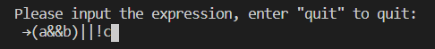

# Truth-Table-Generator
Command line program that print truth table from given input using "&amp;&amp;", "||" or "!"
## Usage
Input your boolean equation from keyboard

Press enter key to print the truth table
Press any key (Windows) or enter key (Linux) to start another calculation
## Syntax
| Operand | Input |
| ------- | ----- |
| AND     | &&    |
| OR      | \|\|  |
| Negate  | !     |

Use of parenthese is supported
